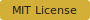

<!-- markdownlint-disable MD041 -->
<div align="center">


# Burme Subtitle Editor

> Professional web-based video subtitle editor with live stream editing, customization, and SRT export capabilities.

[](./LICENSE)
[
[](https://github.com/burme-editor/burme-subtitle-editor/actions)

---

## ✨ Features

| Feature | Description |
|:--------|:------------|
| 🎬 **Live Stream Editor** | Edit subtitles in real-time while your video plays |
| 🎨 **Custom Styling** | Full control over fonts, colors, and backgrounds |
| 📥 **SRT Export** | Download subtitles in standard .SRT format |
| ⌨️ **Keyboard Shortcuts** | Efficient keyboard-driven workflow |
| 🐳 **Dockerized** | Easy deployment with Docker Compose |

---

## 🚀 Quick Start

### Option 1: Run Locally (Browser)

Simply open `index.html` in any modern browser:

```bash
# macOS
open index.html

# Linux
xdg-open index.html

# Windows
start index.html
```

### Option 2: Docker Compose

```bash
# Clone and navigate
git clone https://github.com/burme-editor/burme-subtitle-editor.git
cd burme-subtitle-editor

# Start all services
docker-compose up --build -d

# Access the application
# Frontend: http://localhost:8080
# API:      http://localhost:8000
```

### Option 3: Backend API Only

```bash
# Navigate to backend
cd backend

# Create virtual environment (recommended)
python -m venv venv
source venv/bin/activate  # Linux/macOS
# venv\Scripts\activate     # Windows

# Install dependencies
pip install -r requirements.txt

# Run the API
python main.py
# Server runs at http://localhost:8000
```

---

## 📖 Documentation

### Keyboard Shortcuts

| Action | Shortcut | Description |
|:-------|:---------|:-----------|
| ▶️ Play/Pause | `Space` | Toggle video playback |
| ➕ Add Subtitle | `Ctrl + A` | Create new subtitle |
| 🗑️ Delete Subtitle | `Delete` | Remove selected subtitle |
| 💾 Save Project | `Ctrl + S` | Save to localStorage |
| 📤 Export SRT | `Ctrl + E` | Download SRT file |
| ⬆️ Previous | `↑` | Jump to previous subtitle |
| ⬇️ Next | `↓` | Jump to next subtitle |

### API Endpoints

| Method | Endpoint | Description | Request Body |
|:-------|:---------|:-----------|:------------|
| `GET` | `/` | API information | - |
| `GET` | `/health` | Health check | - |
| `POST` | `/api/subtitles/convert` | SRT → JSON | `{"srt_content": "..."}` |
| `POST` | `/api/subtitles/export` | JSON → SRT | `[{"text": "...", "start": 0, "end": 3000}]` |
| `POST` | `/api/subtitles/validate` | Validate subtitles | `[...]` |
| `POST` | `/api/subtitles/shift` | Shift timestamps | `[...], {"offset_ms": 1000}` |
| `POST` | `/api/subtitles/scale` | Scale timestamps | `[...], {"scale_factor": 1.5}` |

---

## 🏗️ Project Structure

```
burme-subtitle-editor/
├── index.html              # Main Vue.js application
├── favicon.svg           # PWA icon (512x512)
├── README.md            # This file
├── LICENSE             # MIT License
├── src/
│   └── assets/
│       ├── css/
│       │   └── style.css  # Gold & Gray theme
│       └── js/
│           └── app.js    # Vue.js logic
├── backend/
│   ├── main.py         # FastAPI application
│   └── requirements.txt  # Python dependencies
├── Dockerfile.frontend    # Nginx container
├── Dockerfile.backend    # Python container
├── docker-compose.yml    # Orchestration
└── nginx.conf          # Nginx config
```

---

## 🎨 Design System

### Color Palette

| Name | Hex | Usage |
|:-----|:---|:------|
| Gray Dark | `#1a1a1a` | Primary background |
| Gray Medium | `#2E2E2E` | Secondary background |
| Gray Light | `#3d3d3d` | Cards, panels |
| Gold | `#D4AF37` | Primary accent |
| Gold Light | `#E5C158` | Hover states |

### Typography

| Element | Font | Weight |
|:--------|:-----|:------|
| Headings | Playfair Display | 600, 700 |
| Body | Inter | 300-700 |

---

## 🐛 Troubleshooting

### Common Issues

**Video not loading**
- Ensure the video file is in a supported format (MP4, WebM, OGG, MOV)
- Check browser console for CORS errors

**Subtitles not syncing**
- Verify browser supports HTML5 video
- Check that video has correct duration metadata

**Export not working**
- Ensure at least one subtitle exists
- Check that text is not empty

---

## 🤝 Contributing

Contributions are welcome! Please read our [contributing guidelines](./CONTRIBUTING.md) first.

1. Fork the repository
2. Create a feature branch (`git checkout -b feature/amazing-feature`)
3. Commit your changes (`git commit -m 'Add amazing feature'`)
4. Push to the branch (`git push origin feature/amazing-feature`)
5. Open a Pull Request

---

## 📝 License

This project is licensed under the [MIT License](./LICENSE) - see the file for details.

---

## 🙏 Acknowledgments

- [Vue.js](https://vuejs.org/) - Progressive JavaScript framework
- [Bootstrap](https://getbootstrap.com/) - CSS framework
- [FastAPI](https://fastapi.tiangolo.com/) - Modern Python web framework
- [Font Awesome](https://fontawesome.com/) - Icon library

<div align="center">

**Made with ❤️ for subtitle creators worldwide**

[](https://github.com/burme-editor/burme-subtitle-editor/stargazers)
[](https://github.com/burme-editor/burme-subtitle-editor/network)

</div>

</div>